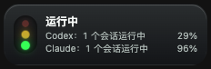

# Session Notice

一个在 macOS 菜单栏常驻的 Codex / Claude Code 会话状态与额度工具。应用名称为 **Notice**。



小组件只显示当前有活动的来源，先开始活动的来源排在上方。左侧显示运行、等待确认或异常状态，右侧显示各自 **7 天剩余额度**。额度随账号变化，图中为演示数据。

## 下载和安装

在 [Releases](https://github.com/lidi1011/session-notice/releases/latest) 下载 `SessionNotice_1.0.0_aarch64.dmg`，打开并把 **Notice.app** 拖入 **Applications**，然后启动。

- 本次发行提供 **Apple Silicon（arm64）** 安装包；Intel 尚未提供。
- App 使用 Developer ID 签名，已通过 Apple 公证并附票据。
- App 仅出现在菜单栏，点击菜单栏图标选择 **Show Notice** 打开设置；关闭主窗口后继续运行，**Quit** 才退出。
- 推荐使用受系统支持的 macOS；本版已在本机验证，其他 macOS 版本尚未逐一实测。
- 如需 ZIP，下载 `SessionNotice_1.0.0_aarch64.zip` 后将 Notice.app 移到 Applications。
- 发布页同时提供 `SHA256SUMS.txt`，可用 `shasum -a 256 -c SHA256SUMS.txt` 校验下载文件。

## 首次接入

### Codex

1. 菜单栏 → Show Notice → **接入源**。
2. 在 **Codex Hook 管理** 中预览并安装 hooks。
3. 重启 Codex 或新开会话，让 hooks 配置加载。

Notice 管理 `~/.codex/config.toml` 中自己的 hooks，并保留其他设置、备份修改前配置。如果同时使用 `hooks.json` 与 `config.toml`，请按当前 Codex 的要求统一 hooks 表示，避免双配置加载警告。不要在不同实例中重复安装同一组 hooks。

Codex 额度从本机可用的 Codex 额度信息中读取；没有可用额度时右侧留空。

### Claude Code

1. **接入源 → Claude Code Hook 管理 → 预览 / 安装**。
2. 新开或重启 Claude Code CLI、Claude Desktop **本地 Code 模式**会话。
3. 普通 Claude Chat、Cowork 和远程执行环境不在本版监控范围内。

App 内置安装/卸载能力，不需要 Python。只合并或删除 Notice 自己的命令，保留原有 hooks 与其他配置，原配置备份到 Notice 数据目录的 `hooks/backups`。如应用启动环境设置了 `CLAUDE_CONFIG_DIR`，使用该目录，否则使用 `~/.claude/settings.json`。

### Claude 7 天额度

1. 在接入源点击 **在浏览器打开 Claude**，使用现有默认浏览器的登录账号。
2. 在 **系统设置 → 隐私与安全性 → 完全磁盘访问**中允许 Notice，重启 Notice。
3. 点击 **刷新额度**；系统如提示读取浏览器安全存储，在钥匙串提示中允许。

支持 Chrome、Arc、Brave、Safari；Chromium 系浏览器使用最近使用的个人资料。Notice 独立读取 Claude 登录态并向 Claude 网站查询额度，不依赖 Claude Usage 或它的缓存。只读取 `claude.ai` 的必要 Cookie，登录凭据不落盘，数据库仅保存额度与更新时间。

首次点击浏览器或刷新入口后启用每 5 分钟刷新；超过 15 分钟、额度窗口重置、认证或权限失败时隐藏旧额度。浏览器切换账号后，点击刷新。Claude 网站的接口和登录保护可能变化，读取失败时按界面提示重新登录、完成网站验证或稍后重试。

## 状态与通知

- 红绿灯表示运行中、等待确认、失败、完成或就绪；三个灯在左侧椭圆中居中排列。
- Codex / Claude 活动行动态出现，完成或空闲后隐藏，等待确认或异常仍保留。
- 飞书通知、开机启动等功能可在应用里配置；渠道密钥使用 macOS Keychain。
- Claude hooks 仅观察事件，不返回权限审批决策；不保存 Claude 提示词或工具参数。
- 本地服务监听 `127.0.0.1:3746`，hook 请求需本机 token。健康检查：`curl http://127.0.0.1:3746/health`。

强制退出、某些中断或缺失事件可能不能立即结束活动状态；当前采用 10 分钟活动超时。长时间没有工具事件的任务也可能暂时不计入。这是当前状态监控的已知边界。

## 从源码构建

需要 macOS、Node.js、pnpm 10、Rust 和 Xcode Command Line Tools。

```bash
git clone https://github.com/lidi1011/session-notice.git
cd session-notice
pnpm install --frozen-lockfile
pnpm build
cargo test --manifest-path src-tauri/Cargo.toml --locked --lib
pnpm tauri build --bundles app -- --locked
```

开发模式：`pnpm tauri:dev`。构建产物在 `src-tauri/target/release/bundle/macos/Notice.app`。本地构建不等于官方签名安装包；需要分发时使用自己的 Developer ID 与 Apple 公证流程，见 [发布说明](docs/releasing.md)。

前端为 Vue 3 / TypeScript / Vite / Pinia / Naive UI，桌面端为 Tauri 2 / Rust，使用 Axum 与 SQLite。

## 来源与许可

基于 [Di-devp/codex-notice](https://github.com/Di-devp/codex-notice) 开发，保留原项目 MIT 许可。Claude 浏览器登录态读取方法参考 [ncreasor/claude-usage](https://github.com/ncreasor/claude-usage)，归属见 [THIRD_PARTY_NOTICES.md](THIRD_PARTY_NOTICES.md)。

本项目采用 [MIT License](LICENSE)。问题和建议请提交 [Issue](https://github.com/lidi1011/session-notice/issues)，不要附带真实 Cookie、密钥、hook token 或数据库。
